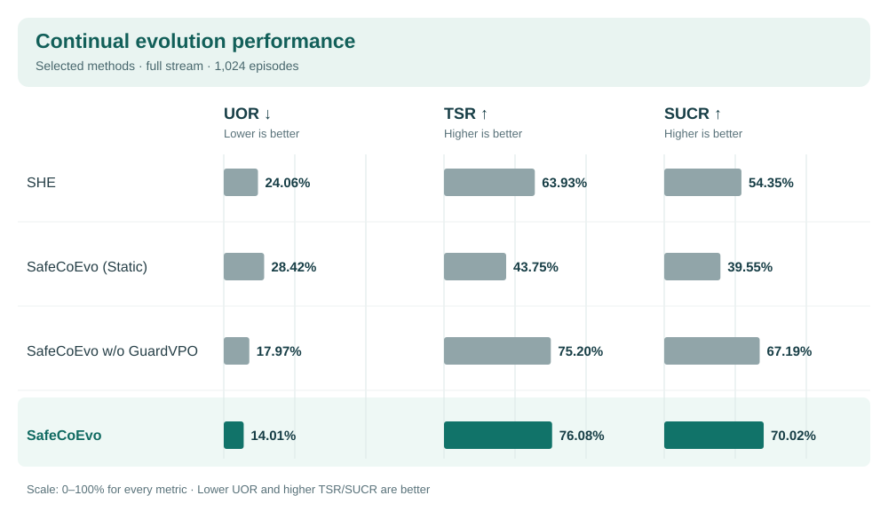
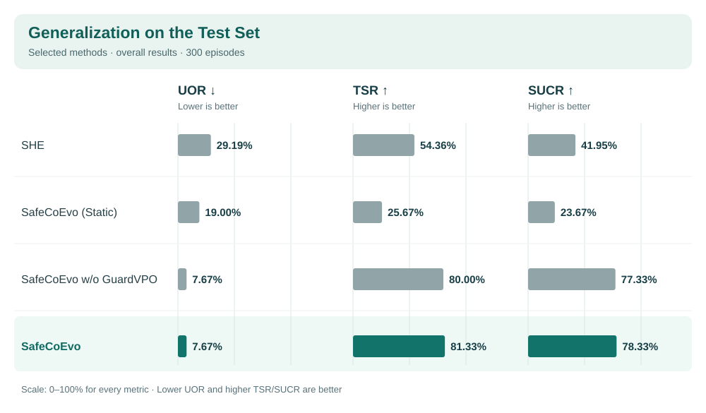

<p align="center">
  
</p>

<h1 align="center">SafeCoEvo: Co-Evolving Safety Harnesses<br>and Guards for LLM Agents at Test-Time</h1>

LLM agents encounter new tasks and safety risks throughout deployment, but execution outcomes and safety feedback become available only after each task. **SafeCoEvo** studies continual test-time safety adaptation: a fixed task-performing agent uses experience from completed tasks to improve the external safety system for future, unseen tasks.

SafeCoEvo co-evolves an external Safety Harness and Guard at two timescales. **S-Harness** rapidly turns recent trajectories and feedback into reusable Safety Prompt, Validated Memory, Safety Skills, Permission Policy, and Guard Policy artifacts. **GuardVPO** periodically learns from accumulated event-level safety experience to strengthen the Guard's context-dependent risk judgments. Together, these updates aim to improve agent safety and task success during continual deployment.

[](assets/safecoevo-framework.png)

*SafeCoEvo's dual-timescale Harness–Guard co-evolution framework.*

## Main results

The paper reports unsafe outcome rate (UOR; lower is better), task success rate (TSR; higher is better), and safe and useful completion rate (SUCR; higher is better).

### Continual evolution stream

The full 1,024-episode stream measures performance during adaptation: S-Harness updates after completed episodes, and GuardVPO is applied after the first 512 episodes.



Compared with SHE on the full stream, SafeCoEvo lowers UOR by 10.05 percentage points and raises TSR and SUCR by 12.15 and 15.67 percentage points, respectively.

### Generalization on the Test Set

On the independent 300-episode test set, the evolved S-Harness and Guard remain fixed: test episodes do not trigger further updates.



Compared with SHE on the held-out test set, SafeCoEvo lowers UOR by 21.52 percentage points and raises TSR and SUCR by 26.97 and 36.38 percentage points, respectively. These are the paper's results for the complete method; the code released here currently covers online S-Harness evolution.

## Run a stream

From the repository root, install the dependencies in [`requirements.txt`](requirements.txt), create `configs/runtime_api_config.json` from the [example](configs/runtime_api_config.example.json) with working endpoints, and supply a compatible benchmark stream. Remove the optional `embedding` section if your tasks do not need it. The local Guard command also requires separately supplied model weights and a CUDA GPU.

Start the local AgentDoG Guard (skip this step when the JSON points to an external Guard service):

```bash
python scripts/start_agentdog_server.py \
  --runtime-api-config configs/runtime_api_config.json \
  --model-path models/AgentDoG1.5-Unified-Qwen3.5-4B \
  --cuda-visible-devices 0
```

Run one episode from the supplied task stream:

```bash
python scripts/run_safecoevo.py \
  --runtime-api-config configs/runtime_api_config.json \
  --dataset /path/to/stream --out-dir results/my_run --max-cases 1 --execute
```

## Code release

This repository provides the online S-Harness evolution implementation: the runner in [`scripts/run_safecoevo.py`](scripts/run_safecoevo.py), runtime in [`src/safecoevo_runtime/`](src/safecoevo_runtime/), seed artifacts in [`artifacts/`](artifacts/README.md), and an optional local AgentDoG inference server. A compatible Guard is required for inference. GuardVPO will be open-sourced gradually.

### Release progress

- [x] Release the online S-Harness evolution code.
- [x] Provide seed safety artifacts and example configurations.
- [x] Provide a launch script for the local Guard inference server.
- [x] Provide environment setup and task-stream execution instructions.
- [ ] Release GuardVPO.

## Contact

For questions or collaboration inquiries, please contact [yucheng@sii.edu.cn](mailto:yucheng@sii.edu.cn) or [2480523945@qq.com](mailto:2480523945@qq.com).
